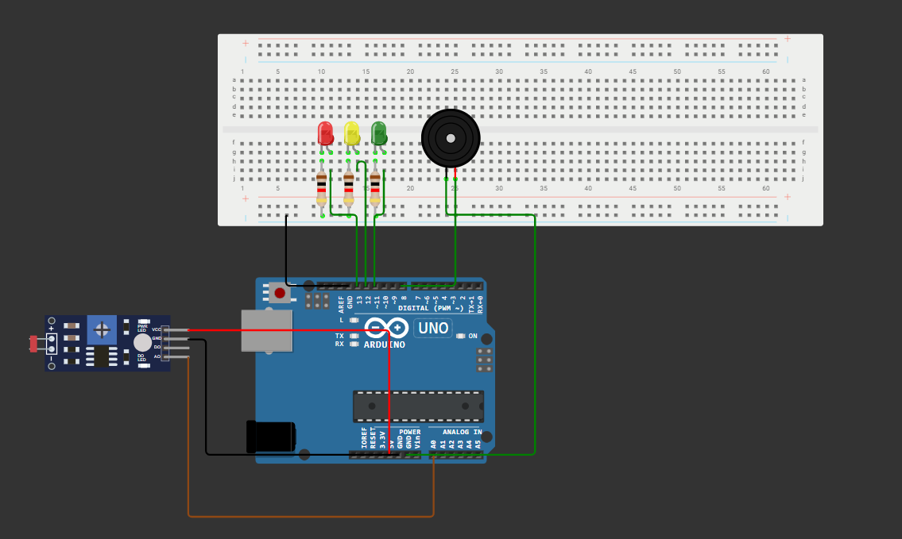

## Projeto de Monitoramento de Luminosidade – Vinheria Agnello

## Descrição do Projeto
Este projeto foi criado especialmente para a Vinheria Agnello, com o objetivo de monitorar a luminosidade do ambiente onde os vinhos são armazenados. A exposição à luz pode afetar diretamente a qualidade dos vinhos, por isso é essencial manter esse controle.

## Objetivo
Desenvolver um sistema de alarme que detecta quando há excesso de luz no local de armazenamento dos vinhos, emitindo um alerta sempre que necessário.


## Materiais Necessários
Arduino UNO


Sensor LDR (Fotoresistor)


Resistores


3 LEDs (Verde, Amarelo e Vermelho)


1 Buzzer (ativo)


Jumpers


Protoboard


Módulo de alimentação USB


## Funcionamento
O sensor LDR é conectado à porta A0 do Arduino e é responsável por medir a intensidade da luz no ambiente. Os valores lidos são analógicos e representam o nível de luminosidade. Com base nesses valores, o sistema acende um LED correspondente (verde, amarelo ou vermelho) e, em caso de necessidade, ativa o alarme sonoro.



## Link com video Explicativo: https://www.youtube.com/shorts/KoIsAowMYmo

## Código do Projeto
```
int ledYellowPin = 7;
int ledRedPin = 9;
int ledGreenPin = 11;
int ldrPhotoSensor = A0;

int boozerPin = 8;
unsigned long boozerStartTime = 0;
bool boozerActive = false;

void setup() {
  pinMode(ledRedPin, OUTPUT);
  pinMode(ledYellowPin, OUTPUT);
  pinMode(ledGreenPin, OUTPUT);
  pinMode(boozerPin, OUTPUT);
  Serial.begin(9600);
}

void loop() {
  int ldrValue = analogRead(ldrPhotoSensor);
  Serial.println(ldrValue);
  unsigned long currentTime = millis();

  
  digitalWrite(ledGreenPin, LOW);
  digitalWrite(ledYellowPin, LOW);
  digitalWrite(ledRedPin, LOW);

  
  if (ldrValue >= 300 && ldrValue <= 400) {
    digitalWrite(ledGreenPin, HIGH);
    noTone(boozerPin);
    boozerActive = false;
  } 
  else if (ldrValue >= 500 && ldrValue <= 600) {
    digitalWrite(ledYellowPin, HIGH);
    noTone(boozerPin);
    boozerActive = false;
  } 
  else if (ldrValue > 600) {
    digitalWrite(ledRedPin, HIGH);
    if (!boozerActive) {
      tone(boozerPin, 262, 3000);  
      boozerStartTime = currentTime;
      boozerActive = true;
    }
  } 
  else {
   
    noTone(boozerPin);
    boozerActive = false;
  }

  delay(200);
}
```
